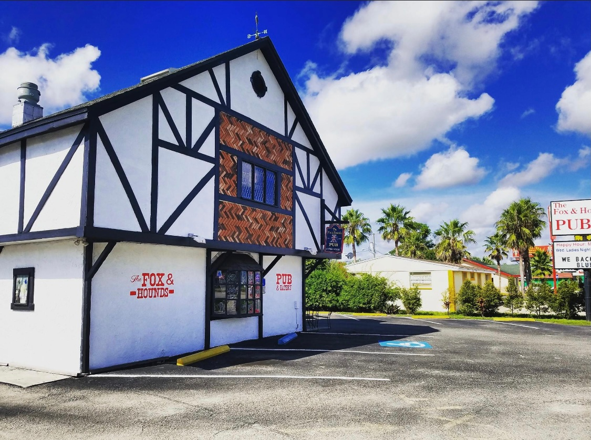
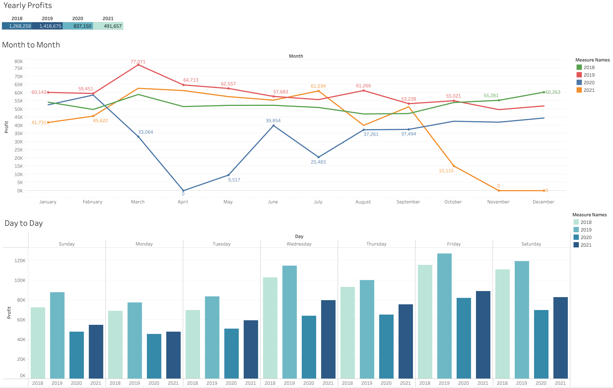
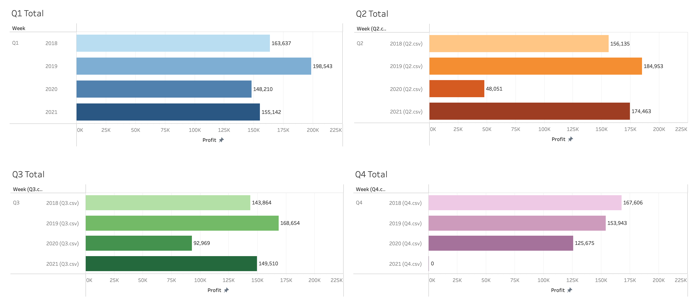

# The Fox and Hound Sale Analysis 

----
## Overview:

The Fox and Hound is one of the oldest, most successful pub-style restaurant in the heart of Kissimmee, Florida. It is a fantastic stop for tourists, and a home to some of the locals. In 2020, the COVID-19 pandemic caused businesses to close temporarily, and some, permanently. 

The purpose of this analysis is to view the sale difference to see how the pandemic affected the restaurant, and to predict changes in the busy seasons from the first quarter of 2018 to the 3rd quarter of 2021

----

## Resources:

Software: Jupyter Lab, Python 3.8 (Pandas, Numpy), Tableau
Data Source: Week by Week Totals.xlsx, Weekly Inventory Sheets.xlsx

----

## Results:

According to the month to month from each year, we can see that 2019 was the most profitable year and 2020 was the lowest. March seems to be the most profitable month for each year. October seems to have an increase of sales each year also.

Within the 4 years, it seems the 1st and 2nd quarter outperforms the 3rd and 4th quarter. When comparing 2018 to 2021, 2021 has a lower 1st quarter but a higher 2nd and 3rd quarter. 

----

## Summary: 

From what we can tell from 2018/2019 compared to 2021, the pandemic has affected sales. Even with a few inconsistencies, 2021 seems to be recovering from the previous year. More data will be needed to compare end of year sales.